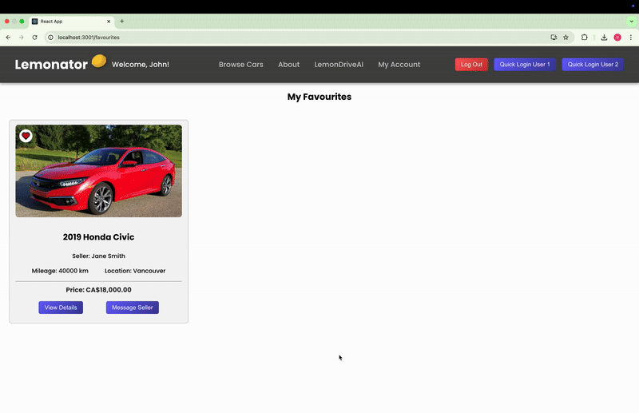
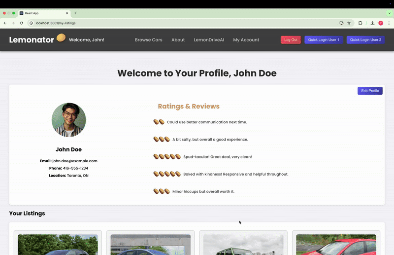
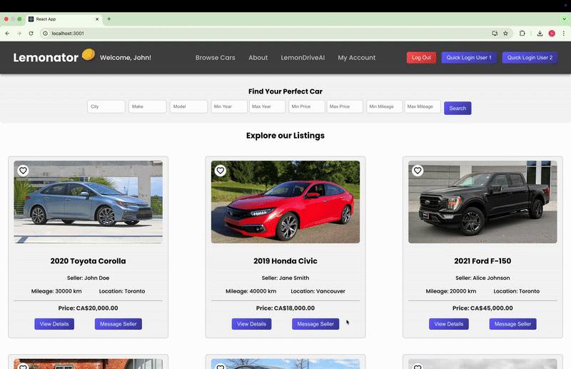
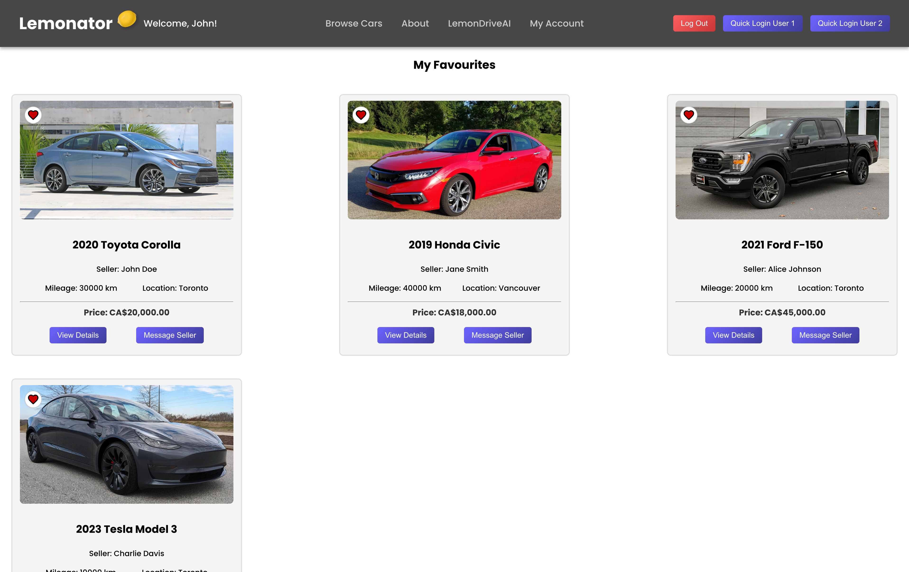
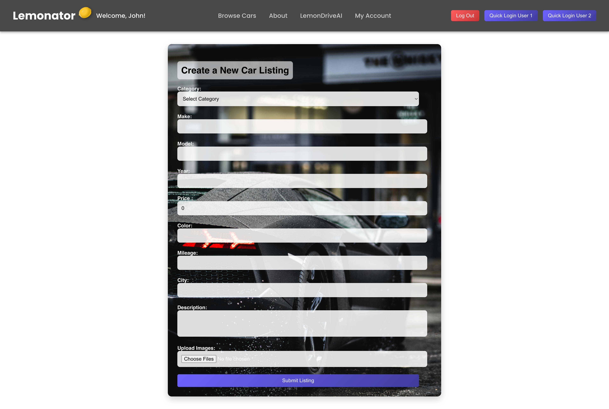
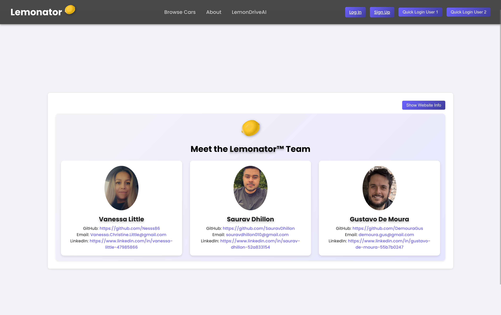

## 🚗 Lemonator – The Ultimate Car Marketplace

Lemonator is a modern car marketplace where users can list, browse, and chat about vehicles in real-time. With live polling-powered messaging, AI chatbot recommendations, and a sleek UI, it provides a seamless experience for car buyers and sellers.

---

## 🔥 Key Features

### 📩 Live Polling Messaging
- **Real-time messaging** system with instant updates.
- Buyers and sellers can chat seamlessly without delays.
- Messages are **auto-refreshed** while logged in.

**🟢 GIF Demo:**  


---

### 🤖 AI-Powered Chatbot
- Provides **smart car buying & selling tips** using OpenAI.
- Helps users make **informed decisions** based on their needs.
- Easily accessible via a **pop-up modal**.

**🟢 GIF Demo:**  


---

### ⭐ Favourite Listings
- Save multiple car listings for **easy access later**.
- Remove listings instantly from **your favorites**.

**🟢 GIF Demo:**  


**🖼 Screenshot:** 


**🖼 Screenshot:** 



---

### 🏠 Landing Page
- **First impression of the app** when a user visits Lemonator.
- Highlights key features and encourages users to explore.

**🖼 Screenshot:**  


---

### 👤 User Profiles
- Each user has a **profile page** showcasing:
  - Their **listings**
  - Their **ratings & reviews**
  - Contact & account details

**🖼 Screenshot (User 1):**  


**🖼 Screenshot (User 2):**  


---

### 🔧 Creating a Car Listing
- Users can **quickly list a car** by filling out a simple form.
- Listings can be **edited or deleted** anytime from the profile.

**🟢 GIF Demo:**  


**🖼 Screenshot (Creating a Listing):**


---

### 🔑 Quick User Login
- **Switch between users instantly** for demo/testing.
- Useful for showcasing live polling and different user views.

**🟢 GIF Demo:**  


---

### 🤝 About the Team
- Meet the developers behind **Lemonator**!

**🖼 Screenshot:**  


---

## 🛠 Tech Stack


### 📦 Key Dependencies

#### **Frontend**
- **React** – UI framework for the client-side.
- **Axios** – API requests and handling.
- **React Router** – Navigation management.
- **Sass** – Styling and preprocessor.

#### **Backend**
- **Ruby on Rails (8.0.1)** – Core backend framework.
- **PostgreSQL** – Database management.
- **Turbo Rails** – Hotwire's real-time page updates.
- **StimulusJS** – JavaScript framework for interactivity.
- **bcrypt** – Secure user authentication.
- **ruby-openai** – AI chatbot integration.

#### **Performance & Development**
- **rack-cors** – Manages cross-origin requests.
- **solid_cache, solid_queue, solid_cable** – Caching and job queue management.
- **dotenv-rails** – Manages environment variables.
- **brakeman** – Security static analysis.
- **rubocop-rails-omakase** – Rails code style enforcement.
- **Capybara & Selenium WebDriver** – System testing.

---

## 🚀 Installation Guide

### 1️⃣ Clone the Repository
```sh
git clone https://github.com/Nesss86/lemonator.git
cd lemonator
```

### 2️⃣ Install Dependencies

#### **Frontend Setup (Runs on Port 3001)**
```sh
cd frontend
npm install
npm start
```

#### **Backend Setup (Runs on Port 3000)
```sh
cd backend
bundle install
rails db:create db:migrate db:seed
rails server
```

## 💡 Note: Make sure your frontend is proxying requests correctly to the backend (http://localhost:3000) by checking package.json:

```sh
"proxy": "http://localhost:3000"
```

## 🔮 Future Enhancements
🚀 Planned Features:

- User Reviews & Ratings → Allow buyers to leave - feedback on sellers.
- Setting up transaction completion using Stripe → Secure payment processing for car purchases.
- Enhanced AI Chatbot → More context-aware recommendations.


## ⭐ Give Us a Star!
If you like Lemonator, consider starring ⭐ this repository to support us!
